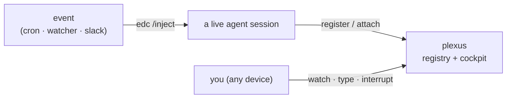

<p align="center" style="margin:.4rem 0 1.2rem;">
  <span style="display:inline-flex;padding:20px 26px;border-radius:18px;background:#0b0d10;box-shadow:0 1px 0 rgba(224,164,74,.15) inset;">
    
  </span>
</p>

# Plexus

**One nervous system for your coding agents, across your machines.**

**Plexus** lets you watch, steer, and feed events to coding-agent sessions (Claude Code, Codex,
OpenCode) running across your machines. The suite is **Plexus**; it's two small, self-hosted Go
binaries that work together — mind the capitalization, one of them is also called `plexus`:

- **[`plexus`](plexus.md)** — the *eyes and hands*. A session **registry**, a web **cockpit** with each
  session's live terminal, and a **launcher** for starting agents you can attach to from anywhere.
- **[`edc`](edc.md)** — the *input*. A uniform `/inject` endpoint that turns an external event (a cron, a
  watcher, a Slack message, another agent) into a **turn** inside a running session.

They're orthogonal and don't know each other's internals — they meet at the session. An event enters a
live session through **edc**; you watch that session work, type into it, or interrupt it through
**plexus**.



## Concepts

A few load-bearing terms, defined once — they recur across every page:

| Term | Meaning |
|---|---|
| **session** | one running coding agent (Claude Code, Codex, or OpenCode) |
| **turn** | one message a session processes, exactly as if a human had typed it |
| **inject** | hand a session an external event so it arrives as a turn — `edc`'s whole job |
| **channel** | the Claude Code capability (`claude/channel`) that lets `edc` push a turn in |
| **registry** | the list of live sessions `plexus serve` keeps (one row each) |
| **cockpit** | the `plexus serve` web dashboard (`/ui`): the fleet plus each session's terminal |
| **attach** | open a session's live terminal — the cockpit reverse-proxies your browser into it |
| **ttyd** | a terminal-over-HTTP server; Plexus runs one per session so the cockpit can attach |
| **edc** | "Event-Driven Coding-agents" — the injector binary |

## Two independent binaries

Plexus is two tools you can install and run **separately or together** — neither depends on the other:

| Binary | What it does | What it needs |
|---|---|---|
| **`plexus`** | registry + cockpit + launcher — see, attach to, and launch sessions | a private address to bind; `tmux` + `ttyd` for the launcher/attach |
| **`edc`** | inject external events into a live session as turns | just the `edc` binary + a shared secret — no registry, no tmux |

Use **`plexus` alone** to watch and launch agents; use **`edc` alone** to make a single session
event-driven; use **both** to get an injectable, attachable fleet. See [plexus](plexus.md) and
[edc](edc.md) for each.

## What it supports

| | |
|---|---|
| **Agents** | Claude Code, Codex, OpenCode — same registry, same inject contract |
| **Platforms** | macOS & Linux (Windows for `edc`); agents run wherever |
| **Machines** | one laptop, or many across a private network |
| **Injection** | external events → turns, per-agent adapters, with a trust boundary |
| **Attach** | a per-session web terminal (view, type, interrupt) behind one login |
| **Transport** | self-hosted; a private network + one shared token is the whole perimeter |

## The 60-second tour

```sh
# launch an agent in a tmux session you can reach from anywhere
plexus claude ~/code/api          # or: plexus codex … / plexus opencode …

# see the fleet
plexus ls                          # table of live sessions
plexus watch                       # live full-screen cockpit (TUI)

# the web cockpit (installable PWA)
open "$PLEXUS_URL/ui"          # sidebar of sessions + each one's live terminal

# wake a session with an external event — the port comes from that session's edc
# state file, the secret from ~/.config/edc/config.json
PORT=$(jq -r .port ~/.local/state/edc/*.json | head -1)
curl -X POST "http://127.0.0.1:$PORT/inject" \
  -H "Authorization: Bearer $(jq -r .inject_secret ~/.config/edc/config.json)" \
  -d '{"source":"cron","event":"nightly","text":"…"}'   # → a turn in that session
```

See [Setup](setup.md) for the from-zero install, then [edc](edc.md) for how injection is wired.

## Where to go next

- **[Setup & requirements](setup.md)** — from one laptop to many machines; the from-zero install.
- **[`plexus`](plexus.md)** — the registry, cockpit, and launcher in depth.
- **[`edc`](edc.md)** — how event injection works and how to wire it.
- **[Architecture](architecture.md)** — how the two tools compose, and the topology.
- **[Agents](agents.md)** — what each agent supports and how it's wired.
- **[Command reference](commands.md)** — every `plexus` and `edc` verb.

!!! note "Design intent"
    `plexus` is built for a developer running a handful of long-lived agent sessions across machines they
    own. The **patterns** — an agent-agnostic registry, a uniform injection contract, and a strict trust
    boundary — generalize to any scale; the **implementation** (a shared token, a single-node SQLite
    registry, tmux-based attach) is a solo-to-small-team reference. See [Setup](setup.md#portability).
